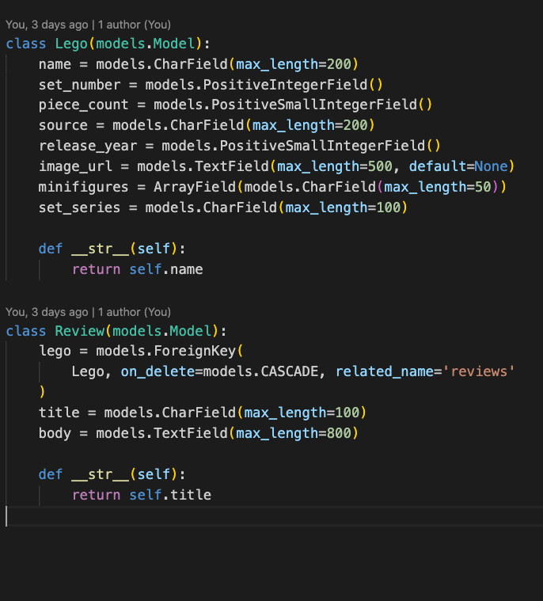
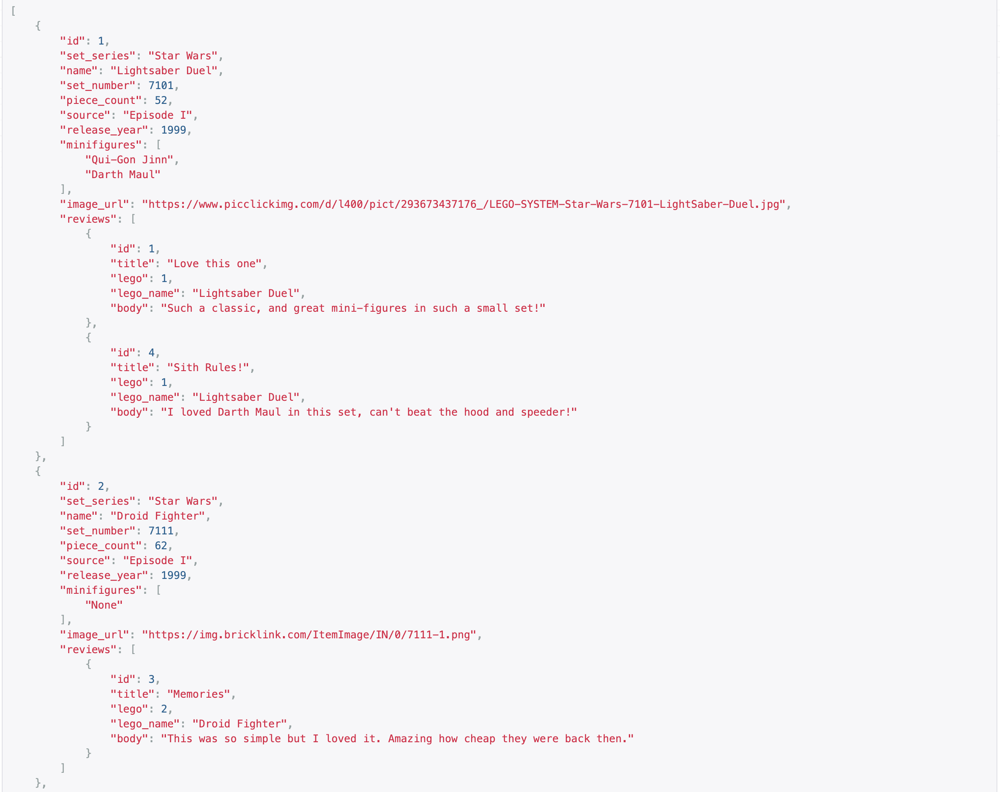

# Lego Collector (Back-end)

## Description
This is the repo for the back-end of the Lego Collector app.
Collecting Legos is a hobby of mine - and I know many others do the same. I buy, I build, I keep them on display, I know all the sites to get after market sets, but I always have a hard time keeping what I have, what I want, and which I'll get next in order. So I decided to make a personal Lego inventory tracker as this app, where a user can see available sets from the database I've curated, find something specific, and save it on a list of their choice, leaving reviews on sets along the way! The database will continue to grow and grow.

---

## Endpoints:
- To SEARCH for a lego set (by name, number, minifigures, series, release year, source): https://pure-sierra-61007.herokuapp.com/legos/?search=vader
- For ALL lego sets: https://pure-sierra-61007.herokuapp.com/legos/
- For SPECIFIC lego set: https://pure-sierra-61007.herokuapp.com/legos/:id

---
- For ALL reviews: https://pure-sierra-61007.herokuapp.com/reviews/
- For SPECIFIC review: https://pure-sierra-61007.herokuapp.com/reviews/:id

---
## Models:

---
## Sample data

## Technologies Used

- Python
- Django
- Django REST Framework
- 

---

## Install Intructions

- Use the application by heading to the front-end URL deployed on heroku - from there you'll be able to browse the extensive catalogue of Star Wars Legos (more to come, Harry Potter etc.), search for what you like, make a list or two, and leave a review.
- OR do your own work to it and fork and clone this repo!

---

## Contribution Guidelines

- If you do fork and clone this repo, please create pull requests to add to it, would love to see more data, if it fits the models. Thanks!