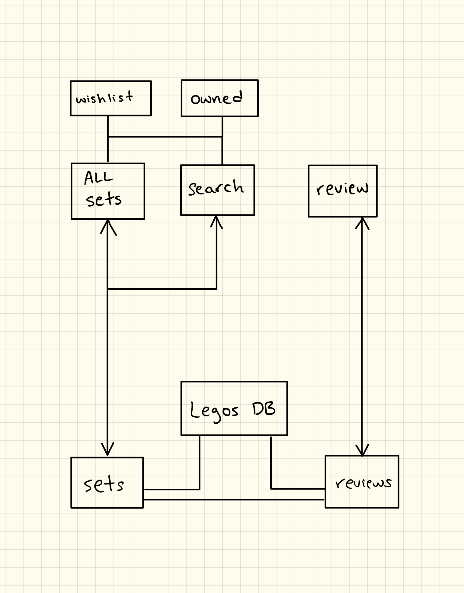

# Planning

## Back-end diagram

---

## User Stories

- As a lego collector, I want to see the full catalogue of every lego set so far, so I can collect them all.
- As a lego collector, I want to see the information on each set like name, pieces, release year etc.
- As a lego collector, I want to be able to save the sets I already own somehow, so I can keep track of what I have.
- As a lego collector, I want to see what I need and be directed to where I can buy it.
- As a lego collector, I want to pick the sets next on my list, to make a wishlist of sorts
